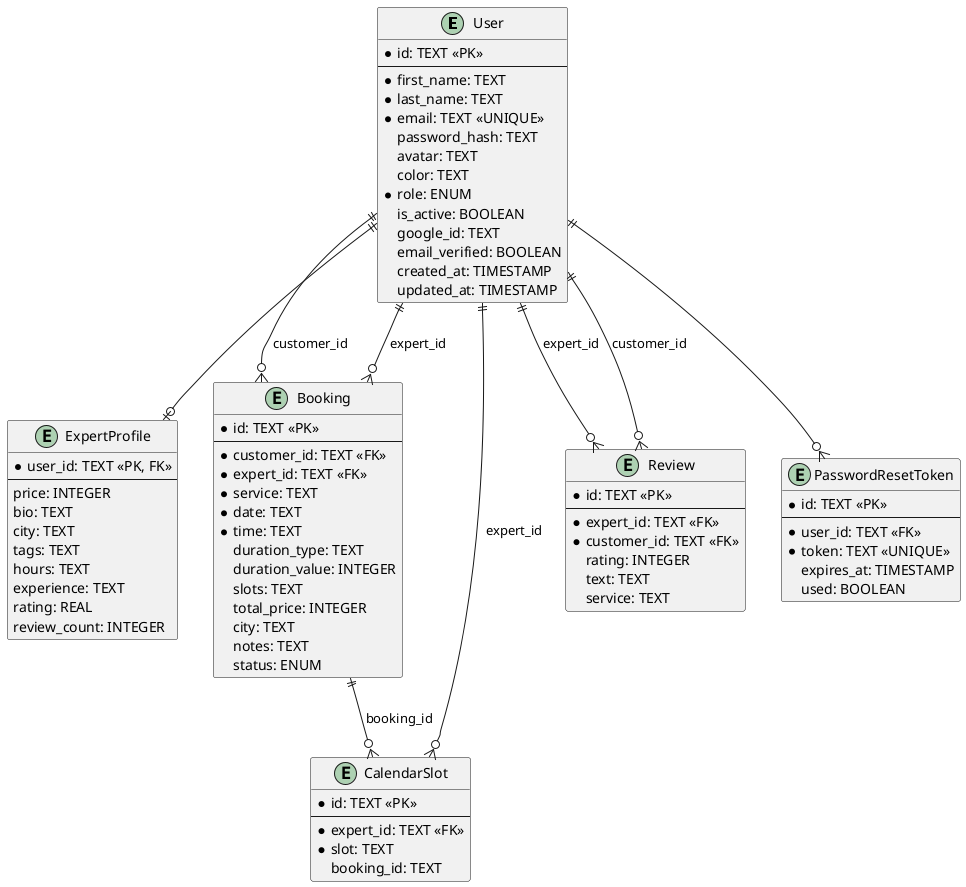

# İŞBUL PLATFORMU — UML DİAGRAMLARI

---

## 1. CLASS DIAGRAM (Sınıf Diyagramı)

```
┌──────────────────────────────────────────────────────────────────────────────────────────────────────────────────────┐
│                                            İŞBUL — CLASS DIAGRAM                                                     │
└──────────────────────────────────────────────────────────────────────────────────────────────────────────────────────┘

                               ┌──────────────────────────────────────┐
                               │               <<entity>>             │
                               │                  User                │
                               ├──────────────────────────────────────┤
                               │ + id: TEXT (PK)                      │
                               │ + firstName: TEXT                    │
                               │ + lastName: TEXT                     │
                               │ + email: TEXT (UNIQUE)               │
                               │ - passwordHash: TEXT                 │
                               │ + avatar: TEXT                       │
                               │ + color: TEXT                        │
                               │ + role: RoleEnum                     │
                               │ + isActive: BOOLEAN                  │
                               │ + googleId: TEXT                     │
                               │ + emailVerified: BOOLEAN             │
                               │ + createdAt: TIMESTAMP               │
                               │ + updatedAt: TIMESTAMP               │
                               ├──────────────────────────────────────┤
                               │ «enum» RoleEnum                      │
                               │   CUSTOMER                           │
                               │   EXPERT                             │
                               │   ADMIN                              │
                               │   PENDING_EXPERT                     │
                               └──────────────┬───────────────────────┘
                                              │
            ┌─────────────────────────────────┼───────────────────────────────────┐
            │ 1                               │ 1                                 │ 1
            │                                 │                                   │
            ▼ 0..1                            ▼ 0..*                              ▼ 0..*
┌────────────────────────┐       ┌────────────────────────────┐      ┌──────────────────────────┐
│       <<entity>>       │       │        <<entity>>           │      │       <<entity>>         │
│     ExpertProfile      │       │          Booking            │      │   PasswordResetToken     │
├────────────────────────┤       ├────────────────────────────┤      ├──────────────────────────┤
│ + userId: TEXT (PK/FK) │       │ + id: TEXT (PK)            │      │ + id: TEXT (PK)          │
│ + price: INTEGER       │       │ + customerId: TEXT (FK)    │      │ + userId: TEXT (FK)      │
│ + bio: TEXT            │       │ + expertId: TEXT (FK)      │      │ + token: TEXT (UNIQUE)   │
│ + city: TEXT           │       │ + service: TEXT            │      │ + expiresAt: TIMESTAMP   │
│ + tags: TEXT[JSON]     │       │ + date: TEXT               │      │ + used: BOOLEAN          │
│ + hours: TEXT          │       │ + time: TEXT               │      │ + createdAt: TIMESTAMP   │
│ + experience: TEXT     │       │ + durationType: TEXT       │      └──────────────────────────┘
│ + rating: REAL         │       │ + durationValue: INTEGER   │
│ + reviewCount: INTEGER │       │ + slots: TEXT[JSON]        │
│ + createdAt: TIMESTAMP │       │ + totalPrice: INTEGER      │
└────────────────────────┘       │ + city: TEXT               │
                                 │ + notes: TEXT              │
            ┌────────────────────│ + status: StatusEnum       │───────────────────┐
            │                    │ + createdAt: TIMESTAMP     │                   │
            │                    │ + updatedAt: TIMESTAMP     │                   │
            │                    ├────────────────────────────┤                   │
            │                    │ «enum» StatusEnum          │                   │
            │                    │   PENDING                  │                   │
            │                    │   CONFIRMED                │                   │
            │                    │   REJECTED                 │                   │
            │                    │   CANCELLED                │                   │
            │                    │   COMPLETED                │                   │
            │                    └─────────────┬──────────────┘                   │
            │                                  │                                   │
            │ 1 expert                         │ 1 booking                        │ 1 expert
            ▼ 0..*                             ▼ 0..*                             ▼ 0..*
┌────────────────────────┐       ┌──────────────────────────┐      ┌──────────────────────────┐
│       <<entity>>       │       │       <<entity>>          │      │       <<entity>>         │
│     CalendarSlot       │       │    (slot association)     │      │         Review           │
├────────────────────────┤       └──────────────────────────┘      ├──────────────────────────┤
│ + id: TEXT (PK)        │                                          │ + id: TEXT (PK)          │
│ + expertId: TEXT (FK)  │◄─── expert_id (User) ───────────────────│ + expertId: TEXT (FK)    │
│ + slot: TEXT           │                                          │ + customerId: TEXT (FK)  │
│ + bookingId: TEXT      │◄─── soft ref (Booking)                  │ + rating: INTEGER (1-5)  │
│ + createdAt: TIMESTAMP │     UNIQUE(expertId, slot)               │ + text: TEXT             │
└────────────────────────┘                                          │ + service: TEXT          │
                                                                    │ + createdAt: TIMESTAMP   │
                                                                    └──────────────────────────┘


──────────────────────────── FLUTTER MOBİL — TEMEL SINIFLAR ────────────────────────────────

┌──────────────────────────┐     ┌──────────────────────────┐     ┌──────────────────────────┐
│     <<model>>            │     │     <<model>>             │     │     <<model>>            │
│      UserModel           │     │     ExpertModel           │     │     ReviewModel          │
├──────────────────────────┤     ├──────────────────────────┤     ├──────────────────────────┤
│ + id: String             │     │ + id: String             │     │ + id: String             │
│ + firstName: String      │     │ + firstName: String      │     │ + reviewerName: String   │
│ + lastName: String       │     │ + lastName: String       │     │ + rating: int            │
│ + email: String          │     │ + avatar: String         │     │ + text: String           │
│ + avatar: String         │     │ + color: String          │     │ + createdAt: DateTime    │
│ + color: String          │     │ + category: String       │     └──────────────────────────┘
│ + role: String           │     │ + city: String           │
│ + isExpert: bool         │     │ + rating: double         │
│ + expertData: ExpertData?│     │ + reviewCount: int       │     ┌──────────────────────────┐
└────────────┬─────────────┘     │ + hourlyRate: int        │     │    <<service>>           │
             │                   │ + isAvailable: bool      │     │    AuthService           │
             │ contains          │ + bio: String            │     │ (ChangeNotifier)         │
             ▼                   │ + skills: List<String>   │     ├──────────────────────────┤
┌──────────────────────────┐     │ + phone: String          │     │ - _user: UserModel?      │
│     <<model>>            │     └──────────────────────────┘     │ - _token: String?        │
│     ExpertData           │                                       │ + login()                │
├──────────────────────────┤     ┌──────────────────────────┐     │ + register()             │
│ + category: String       │     │    <<service>>           │     │ + logout()               │
│ + city: String           │     │   ExpertService          │     │ + loadUser()             │
│ + rating: double         │     ├──────────────────────────┤     └──────────────────────────┘
│ + reviewCount: int       │     │ + getExperts()           │
│ + hourlyRate: int        │     │ + getExpert(id)          │
│ + isAvailable: bool      │     │ + getReviews(id)         │
└──────────────────────────┘     └──────────────────────────┘
```

---

## 2. USE CASE DIAGRAM (Kullanım Senaryosu Diyagramı)

```
┌──────────────────────────────────────────────────────────────────────────────────────────────┐
│                                  İŞBUL SİSTEMİ                                               │
│                                                                                              │
│  ┌─────────────────────────────────────────────────────────────────────────────────────────┐ │
│  │                            <<include>> AUTHENTICATION                                   │ │
│  │                                                                                         │ │
│  │   (Kayıt Ol E-posta)   (Google ile Giriş)   (Şifremi Unuttum)   (Şifre Sıfırla)        │ │
│  └─────────────────────────────────────────────────────────────────────────────────────────┘ │
│                                                                                              │
│  ┌──────────────────────────────────────────┐                                               │
│  │              MÜŞTERİ (Customer)          │                                               │
│  │                                          │                                               │
│  │  ○ Uzmanları Listele & Filtrele          │                                               │
│  │  ○ Uzman Profilini Görüntüle             │                                               │
│  │  ○ Slot Müsaitliğini Kontrol Et          │                                               │
│  │  ○ Rezervasyon Oluştur                   │         ┌──────────────────────────────────┐ │
│  │  ○ Rezervasyonlarımı Görüntüle           │         │        UZMAN (Expert)            │ │
│  │  ○ Rezervasyonu İptal Et                 │         │                                  │ │
│  │  ○ Yorum / Puan Ekle                     │         │  ○ Uzman Profilini Güncelle      │ │
│  │  ○ Bildirimlerimi Görüntüle              │         │  ○ Gelen Rezervasyonları Gör     │ │
│  │  ○ İstatistiklerimi Gör                  │         │  ○ Rezervasyonu Onayla/Reddet    │ │
│  │  ○ Profil Güncelle                       │         │  ○ Rezervasyonu Tamamla          │ │
│  │  ○ Şifre Değiştir                        │         │  ○ Meşgul Slotları Gör           │ │
│  │  ○ Hesabı Sil                            │         │  ○ Kazanç İstatistikleri         │ │
│  │  ○ AI Chatbot Kullan                     │         │  ○ Uzman Panelini Kullan         │ │
│  │  ○ Uzman Başvurusu Yap ──────────────────│──────── │◄─ [extend]                       │ │
│  └──────────────────────────────────────────┘         └──────────────────────────────────┘ │
│                                                                                              │
│  ┌──────────────────────────────────────────────────────────────────────────────────────┐   │
│  │                               ADMİN (Admin)                                         │   │
│  │                                                                                      │   │
│  │  ○ Platform İstatistiklerini Görüntüle     ○ Uzman Başvurularını İncele             │   │
│  │  ○ Tüm Kullanıcıları Listele/Ara           ○ Uzman Başvurusunu Onayla               │   │
│  │  ○ Kullanıcı Detayını Görüntüle            ○ Uzman Başvurusunu Reddet               │   │
│  │  ○ Kullanıcı Rolü Değiştir                 ○ Tüm Rezervasyonları Görüntüle          │   │
│  │  ○ Kullanıcı Aktif/Pasif Yap               ○ Admin Paneline Eriş                    │   │
│  │  ○ Kullanıcı Sil                                                                    │   │
│  └──────────────────────────────────────────────────────────────────────────────────────┘   │
│                                                                                              │
│  ┌───────────────────────────────────┐      ┌──────────────────────────────────────────┐   │
│  │    GOOGLE OAuth                   │      │       AI Chatbot (Groq Llama 3.1)        │   │
│  │    <<external actor>>             │      │       <<external system>>                │   │
│  │    Google Identity Platform       │      │       Tüm roller kullanabilir            │   │
│  └───────────────────────────────────┘      └──────────────────────────────────────────┘   │
└──────────────────────────────────────────────────────────────────────────────────────────────┘

AKTÖRLER:
  👤 Ziyaretçi (Giriş yapmamış) → Sadece auth + uzman listeleme
  👤 Müşteri (customer)          → Tüm müşteri özellikleri
  👤 Uzman (expert)              → Müşteri + uzman özellikleri
  👤 Admin (admin)               → Tüm sistem yönetimi
  ⚙️  Sistem (otomatik)          → Rating güncelleme, slot yönetimi
```

---

## 3. SEQUENCE DIAGRAM 1 — Rezervasyon Oluşturma Akışı

```
   Müşteri          Browser/App          Backend API           PostgreSQL          Uzman
      │                  │                    │                     │                │
      │ 1. Uzman profil  │                    │                     │                │
      │─────────────────►│                    │                     │                │
      │                  │ GET /experts/:id   │                     │                │
      │                  │───────────────────►│                     │                │
      │                  │                    │ SELECT expert+reviews               │
      │                  │                    │────────────────────►│                │
      │                  │                    │◄────────────────────│                │
      │                  │◄───────────────────│                     │                │
      │◄─────────────────│                    │                     │                │
      │                  │                    │                     │                │
      │ 2. Tarih seç,    │                    │                     │                │
      │    slotları gör  │                    │                     │                │
      │─────────────────►│                    │                     │                │
      │                  │ GET /calendar/:id/slots                  │                │
      │                  │───────────────────►│                     │                │
      │                  │                    │ SELECT calendar_slots WHERE expert   │
      │                  │                    │────────────────────►│                │
      │                  │                    │◄────────────────────│                │
      │                  │◄───────────────────│  [dolu slotlar]     │                │
      │◄─────────────────│                    │                     │                │
      │                  │                    │                     │                │
      │ 3. Slot seç,     │                    │                     │                │
      │    müsaitlik     │                    │                     │                │
      │─────────────────►│                    │                     │                │
      │                  │ POST /calendar/:id/check                 │                │
      │                  │───────────────────►│                     │                │
      │                  │                    │ SELECT UNIQUE(expert,slot)          │
      │                  │                    │────────────────────►│                │
      │                  │                    │◄────────────────────│                │
      │                  │◄───────────────────│ [müsait: true/false]│                │
      │◄─────────────────│                    │                     │                │
      │                  │                    │                     │                │
      │ 4. Rezervasyon   │                    │                     │                │
      │    oluştur       │                    │                     │                │
      │─────────────────►│                    │                     │                │
      │                  │ POST /bookings     │                     │                │
      │                  │  {expertId, service, date, time,         │                │
      │                  │   slots, totalPrice, city, notes}        │                │
      │                  │───────────────────►│                     │                │
      │                  │                    │ ┌──────────────────────────────────┐│
      │                  │                    │ │ Çakışma kontrolü (slot_key check)││
      │                  │                    │ │ ─────────────────────────────────││
      │                  │                    │ │ INSERT INTO bookings             ││
      │                  │                    │ │ INSERT INTO calendar_slots       ││
      │                  │                    │ │   (her slot için)                ││
      │                  │                    │ └──────────────────────────────────┘│
      │                  │                    │────────────────────►│                │
      │                  │                    │◄────────────────────│                │
      │                  │◄───────────────────│ {booking: {id, status: "pending"}}  │
      │◄─────────────────│                    │                     │                │
      │                  │                    │                     │                │
      │ 5. Bildirim bekle│                    │                     │                │
      │                  │                    │    [GET /notifications]             │
      │                  │                    │                     │ Uzman siteye   │
      │                  │                    │                     │ girip listeyi  │
      │                  │                    │                     │ görür ──────── │►
      │                  │                    │                     │                │
      │                  │                    │                     │ Uzman onayla   │
      │                  │                    │              PATCH /bookings/:id/status
      │                  │                    │◄────────────────────────────────────│
      │                  │                    │ UPDATE bookings SET status="confirmed"
      │                  │                    │────────────────────►│                │
      │                  │                    │◄────────────────────│                │
      │                  │                    │────────────────────────────────────►│
      │                  │                    │ {booking: {status: "confirmed"}}    │
      │                  │                    │                     │                │
      │ 6. Müşteri       │                    │                     │                │
      │ bildirimi görür  │                    │                     │                │
      │─────────────────►│ GET /notifications │                     │                │
      │                  │───────────────────►│ SELECT bookings WHERE customer_id   │
      │                  │                    │────────────────────►│                │
      │                  │                    │◄────────────────────│                │
      │◄─────────────────│◄───────────────────│ [onaylandı bildirimi]               │
```

---

## 4. SEQUENCE DIAGRAM 2 — Google OAuth Akışı

```
  Kullanıcı        Browser         Backend API          Google Auth            DB
      │               │                │                    │                   │
      │ "Google ile   │                │                    │                   │
      │  Giriş Yap"   │                │                    │                   │
      │──────────────►│                │                    │                   │
      │               │ GET /auth/google                    │                   │
      │               │───────────────►│                    │                   │
      │               │                │ passport.authenticate('google')        │
      │               │◄───────────────│ 302 redirect ──────────────────────────────►
      │               │                │                    │                   │
      │               │ (Google giriş sayfasına yönlendirildi)                  │
      │◄──────────────│                │                    │                   │
      │               │                │                    │                   │
      │ Google hesabı │                │                    │                   │
      │ seçer & izin  │                │                    │                   │
      │ verir         │                │                    │                   │
      │──────────────►│──────────────────────────────────────────────────────► │
      │               │                │                    │                   │
      │               │                │◄─── callback code ─│                   │
      │               │ GET /auth/google/callback?code=...  │                   │
      │               │───────────────►│                    │                   │
      │               │                │ Token Exchange     │                   │
      │               │                │───────────────────►│                   │
      │               │                │◄─── {access_token, id_token} ─────────│
      │               │                │                    │                   │
      │               │                │ verifyIdToken      │                   │
      │               │                │ {googleId, email, name, picture}       │
      │               │                │                    │                   │
      │               │                │ Find or Create User                    │
      │               │                │────────────────────────────────────────►
      │               │                │  SELECT * FROM users WHERE googleId=?  │
      │               │                │◄───────────────────────────────────────│
      │               │                │                    │                   │
      │               │                │ [user yok ise]     │                   │
      │               │                │  INSERT INTO users (googleId, email, name, ...)
      │               │                │────────────────────────────────────────►
      │               │                │◄───────────────────────────────────────│
      │               │                │                    │                   │
      │               │                │ JWT signToken(userId, email, role)      │
      │               │                │                    │                   │
      │               │◄───────────────│ 302 → /oauth-callback.html?token=JWT   │
      │◄──────────────│                │                    │                   │
      │               │                │                    │                   │
      │ oauth-callback.html çalışır:   │                    │                   │
      │ localStorage.setItem('isbul_jwt', token)            │                   │
      │ window.location.href = 'index.html'                 │                   │
      │               │                │                    │                   │
      │ Ana sayfaya   │                │                    │                   │
      │ yönlendirildi │                │                    │                   │
      │◄──────────────│                │                    │                   │
```

---

## 5. SEQUENCE DIAGRAM 3 — Uzman Başvurusu & Onay Akışı

```
  Kullanıcı      uzman-ol.html      Backend API          PostgreSQL         Admin
      │               │                  │                    │               │
      │ Formu doldurur│                  │                    │               │
      │──────────────►│                  │                    │               │
      │               │ POST /auth/register                   │               │
      │               │  {role: 'pending_expert',             │               │
      │               │   firstName, lastName, email,         │               │
      │               │   password, tags, bio, city, price}   │               │
      │               │─────────────────►│                    │               │
      │               │                  │ Hash password      │               │
      │               │                  │ INSERT INTO users  │               │
      │               │                  │  (role='pending_expert')           │
      │               │                  │───────────────────►│               │
      │               │                  │ INSERT INTO expert_profiles        │
      │               │                  │───────────────────►│               │
      │               │                  │◄───────────────────│               │
      │               │◄─────────────────│ {token, user: {role: 'pending_expert'}}
      │◄──────────────│                  │                    │               │
      │ "Başvurunuz   │                  │                    │               │
      │  alındı"      │                  │                    │               │
      │               │                  │                    │               │
      │               │                  │                    │  Admin panele  │
      │               │                  │                    │  giriş yapar  │
      │               │                  │ GET /admin/applications            │◄──────
      │               │                  │◄───────────────────────────────────│
      │               │                  │ SELECT users WHERE role='pending_expert'
      │               │                  │───────────────────►│               │
      │               │                  │◄───────────────────│               │
      │               │                  │───────────────────────────────────►│
      │               │                  │ [pending_expert listesi]            │
      │               │                  │                    │               │
      │               │                  │                    │ Admin onayla  │
      │               │                  │ PATCH /admin/applications/:id/approve
      │               │                  │◄───────────────────────────────────│
      │               │                  │                    │               │
      │               │                  │ UPDATE users SET role='expert'      │
      │               │                  │───────────────────►│               │
      │               │                  │◄───────────────────│               │
      │               │                  │───────────────────────────────────►│
      │               │                  │ {success: true, message: 'Onaylandı'}
      │               │                  │                    │               │
      │               │                  │                    │               │
      │ Kullanıcı     │                  │                    │               │
      │ sonraki girişte role=expert      │                    │               │
      │──────────────►│ POST /auth/login │                    │               │
      │               │─────────────────►│ SELECT user WHERE email=?         │
      │               │                  │───────────────────►│               │
      │               │                  │◄───────────────────│               │
      │               │◄─────────────────│ {token, user: {role: 'expert'}}    │
      │◄──────────────│                  │                    │               │
      │ Uzman paneline│                  │                    │               │
      │ erişim var!   │                  │                    │               │
```

---

## 6. COMPONENT DIAGRAM (Bileşen Diyagramı)

```
┌──────────────────────────────────────────────────────────────────────────────────────────────────┐
│                                  İŞBUL PLATFORM MİMARİSİ                                         │
└──────────────────────────────────────────────────────────────────────────────────────────────────┘

┌─────────────────────────────────────┐         ┌─────────────────────────────────────┐
│           WEB CLIENT                │         │          MOBİL CLIENT (Flutter)      │
│         (HTML/CSS/JS + PWA)         │         │          iOS & Android              │
├─────────────────────────────────────┤         ├─────────────────────────────────────┤
│  ┌──────────┐  ┌──────────────────┐ │         │  ┌────────────────────────────────┐ │
│  │ 21 HTML  │  │   assets/js/     │ │         │  │    Flutter Screens             │ │
│  │  Pages   │  │ ┌──────────────┐ │ │         │  │  SplashScreen                 │ │
│  │          │  │ │ api-client.js│ │ │         │  │  LoginScreen / RegisterScreen  │ │
│  │          │  │ │ app.js       │ │ │         │  │  HomeScreen                   │ │
│  │          │  │ │ analytics.js │ │ │         │  │  ExpertsScreen                │ │
│  │          │  │ │ chatbot.js   │ │ │         │  │  ExpertDetailScreen           │ │
│  │          │  │ │ data.js      │ │ │         │  │  ProfileScreen                │ │
│  └──────────┘  │ └──────────────┘ │ │         │  └────────────────────────────────┘ │
│                │ ┌──────────────┐ │ │         │  ┌────────────────────────────────┐ │
│                │ │ manifest.json│ │ │         │  │     State Management           │ │
│                │ │ sw.js (PWA)  │ │ │         │  │     AuthService (Provider)     │ │
│                │ └──────────────┘ │ │         │  └────────────────────────────────┘ │
│                └──────────────────┘ │         │  ┌────────────────────────────────┐ │
└──────────────────────┬──────────────┘         │  │  ExpertService / ApiClient     │ │
                       │                        └──────────────────┬────────────────┘ │
                       │ HTTPS                              HTTPS  │                   │
                       └──────────────────┬────────────────────────┘                   │
                                          │                                             │
                       ┌──────────────────▼────────────────────────────────────────────┐
                       │                   BACKEND API (Node.js + Express)             │
                       │                    http://localhost:3001 / api.isbul.online    │
                       ├──────────────────────────────────────────────────────────────┤
                       │                                                               │
                       │  ┌─────────────────────────────────────────────────────────┐ │
                       │  │                   Middleware Pipeline                    │ │
                       │  │  helmet → cors → morgan → passport → rateLimit → routes │ │
                       │  └─────────────────────────────────────────────────────────┘ │
                       │                                                               │
                       │  ┌───────────┐ ┌──────────┐ ┌──────────┐ ┌───────────────┐ │
                       │  │   auth    │ │  users   │ │ experts  │ │   bookings    │ │
                       │  │  module   │ │  module  │ │  module  │ │    module     │ │
                       │  └───────────┘ └──────────┘ └──────────┘ └───────────────┘ │
                       │  ┌───────────┐ ┌──────────┐ ┌──────────┐ ┌───────────────┐ │
                       │  │ calendar  │ │ reviews  │ │notificat.│ │     admin     │ │
                       │  │  module   │ │  module  │ │  module  │ │    module     │ │
                       │  └───────────┘ └──────────┘ └──────────┘ └───────────────┘ │
                       │  ┌────────────────────┐                                      │
                       │  │   chatbot module   │ ──────────────────────► Groq API    │
                       │  │  (Llama 3.1-70B)   │                         (external) │
                       │  └────────────────────┘                                      │
                       │                                                               │
                       │  ┌─────────────────────────────────────────────────────────┐ │
                       │  │              DB Adapter (db/index.js)                   │ │
                       │  │  DATABASE_URL? → postgres.js  :  database.js (SQLite)   │ │
                       │  └───────────────────────┬─────────────────────────────────┘ │
                       └─────────────────────────┬┘                                   │
                                                 │                                     │
               ┌─────────────────────────────────▼──────────────────────────────────┐  │
               │                    DATA LAYER                                        │  │
               │                                                                      │  │
               │   ┌──────────────────────────────┐  ┌───────────────────────────┐  │  │
               │   │   PostgreSQL (Supabase)       │  │   Google OAuth            │  │  │
               │   │   aws-1-eu-west-3.pooler.     │  │   (external)              │  │  │
               │   │   supabase.com:6543           │  │   accounts.google.com     │  │  │
               │   │                               │  └───────────────────────────┘  │  │
               │   │   Tables:                     │                                  │  │
               │   │   • users                     │  ┌───────────────────────────┐  │  │
               │   │   • expert_profiles           │  │   (Development)           │  │  │
               │   │   • bookings                  │  │   SQLite (local file)     │  │  │
               │   │   • calendar_slots            │  │   isbul.db                │  │  │
               │   │   • reviews                   │  └───────────────────────────┘  │  │
               │   │   • password_reset_tokens     │                                  │  │
               │   └──────────────────────────────┘                                  │  │
               └──────────────────────────────────────────────────────────────────────┘  │
```

---

## 7. STATE DIAGRAM — Booking (Rezervasyon Durum Makinesi)

```
                          ┌─────────────────┐
                          │   Rezervasyon    │
                          │   Oluşturuldu   │
                          └────────┬────────┘
                                   │
                                   ▼
                          ┌─────────────────┐
                          │                 │
                          │    PENDING      │◄──── Müşteri rezervasyon oluşturur
                          │   (Bekliyor)    │      POST /bookings
                          └────────┬────────┘
                                   │
                  ┌────────────────┼────────────────┐
                  │                │                │
                  │ Uzman Onayla   │ Uzman Reddet   │ Müşteri İptal
                  │ PATCH /status  │ PATCH /status  │ PATCH /status
                  │ {confirmed}    │ {rejected}     │ {cancelled}
                  ▼                ▼                ▼
         ┌──────────────┐  ┌──────────────┐  ┌──────────────┐
         │              │  │              │  │              │
         │  CONFIRMED   │  │  REJECTED    │  │  CANCELLED   │
         │  (Onaylandı) │  │  (Reddedildi)│  │  (İptal)     │
         └──────┬───────┘  └──────────────┘  └──────────────┘
                │                │                  │
                │                └──────────────────┘
                │              calendar_slots temizlenir
                │              (slot müsait hale gelir)
                │
                │ Uzman tamamla
                │ PATCH /status {completed}
                │
                ▼
         ┌──────────────┐
         │              │
         │  COMPLETED   │──── Müşteri yorum ekleyebilir
         │ (Tamamlandı) │     POST /reviews/:expertId
         └──────────────┘     (expert rating güncellenir)

────────────────────────────────────────────────────────
YETKİ KURALLARI:
  Uzman yapabilir:   PENDING → CONFIRMED
                     PENDING → REJECTED
                     CONFIRMED → COMPLETED
  Müşteri yapabilir: PENDING → CANCELLED
                     CONFIRMED → CANCELLED
  Admin yapabilir:   Tümü
────────────────────────────────────────────────────────
```

---

## 8. ENTITY RELATIONSHIP DIAGRAM (ERD)

```
┌──────────────────┐        ┌───────────────────────────────┐
│      users       │        │        expert_profiles         │
├──────────────────┤        ├───────────────────────────────┤
│ id (PK)          │◄───────│ user_id (PK, FK)               │
│ first_name       │ 1   1  │ price                         │
│ last_name        │        │ bio                           │
│ email (UNIQUE)   │        │ city                          │
│ password_hash    │        │ tags (JSON)                   │
│ avatar           │        │ hours                         │
│ color            │        │ experience                    │
│ role             │        │ rating                        │
│ is_active        │        │ review_count                  │
│ google_id        │        │ created_at                    │
│ email_verified   │        └───────────────────────────────┘
│ created_at       │
│ updated_at       │        ┌──────────────────────────────┐
└────────┬─────────┘        │    password_reset_tokens     │
         │                  ├──────────────────────────────┤
         │ 1:N (customer)   │ id (PK)                      │
         │                  │ user_id (FK)                 │◄─── 1:N
         │ ┌────────────────│ token (UNIQUE)               │
         │ │                │ expires_at                   │
         │ │                │ used                         │
         │ ▼                │ created_at                   │
         │ ┌───────────────────┐ └──────────────────────────────┘
         │ │     bookings       │
         │ ├───────────────────┤
         │ │ id (PK)           │
         │ │ customer_id (FK)──│──── N:1 (users.id)
         │ │ expert_id (FK)  ──│──── N:1 (users.id)
         │ │ service           │
         │ │ date              │        ┌──────────────────┐
         │ │ time              │        │   calendar_slots  │
         │ │ duration_type     │        ├──────────────────┤
         │ │ duration_value    │        │ id (PK)          │
         │ │ slots (JSON)      │───────►│ expert_id (FK)   │
         │ │ total_price       │ 1  N   │ slot             │
         │ │ city              │        │ booking_id       │◄── soft ref
         │ │ notes             │        │ created_at       │
         │ │ status            │        │ UNIQUE(expert,slot)
         │ │ created_at        │        └──────────────────┘
         │ │ updated_at        │
         │ └───────────────────┘
         │ 1:N (expert)
         │
         │ ┌──────────────────┐
         └►│     reviews       │
           ├──────────────────┤
           │ id (PK)          │
           │ expert_id (FK)   │◄─── N:1 (users.id)
           │ customer_id (FK) │◄─── N:1 (users.id)
           │ rating (1-5)     │
           │ text             │
           │ service          │
           │ created_at       │
           └──────────────────┘

RELATIONSHIPS:
  users ──────────── expert_profiles    : 1-to-1 (optional)
  users ──────────── bookings           : 1-to-many (customer_id)
  users ──────────── bookings           : 1-to-many (expert_id)
  users ──────────── calendar_slots     : 1-to-many (expert_id)
  users ──────────── reviews            : 1-to-many (expert_id)
  users ──────────── reviews            : 1-to-many (customer_id)
  users ──────────── password_reset_tokens : 1-to-many
  bookings ────────── calendar_slots    : 1-to-many (soft ref, booking_id)
```

---

## KULLANIM KILAVUZU

Bu UML diyagramlarını Word raporunuza nasıl eklersiniz:

**Seçenek 1 — Text Olarak Kopyalayın**
Monospace font (Courier New 8pt) ile word'e yapıştırın.

**Seçenek 2 — draw.io ile Görsel Yapın**
draw.io.app → Yeni Diyagram → bu metni referans alarak çizin.

**Seçenek 3 — PlantUML ile PNG Üretin**
plantuml.com'a gidin, aşağıdaki kodu çalıştırın:



